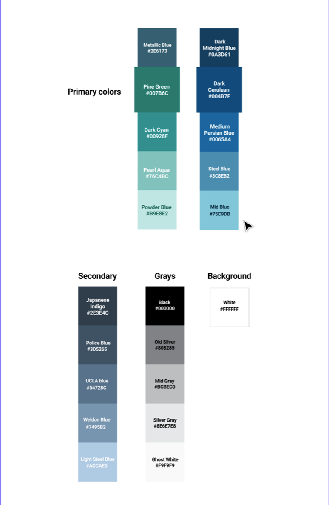

## Principles

## Communication is key

Although we value an aesthetically pleasing use of color, clear communication is our focus. We use colors to support the purpose of the content, communicating things like hierarchy of information, interactive states, and the difference between distinct elements.  

## Colors follow accessibility guidelines

The color system is designed to generate themes that meet WCAG 2.1 compliant contrast ratios. This makes things easier to find, identify, and interact with. It also makes the whole experience more accessible for visitors who are color blind or who have low vision. However, you should never convey information using color alone.

