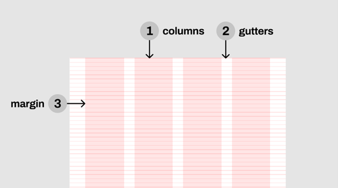

The responsive layout grid is made up of three elements: columns, gutters, and margins.

## Columns

Content is placed in the areas of the screen that contain columns. The number of columns displayed in the grid is determined by the breakpoint range, a range of predetermined screen sizes. A breakpoint can correspond with mobile, tablet, or other screen type.

 

On mobile, at a breakpoint of 480px, this layout grid uses 4 columns.

 

On tablet, at a breakpoint of 834px, this layout grid uses 8 columns.

   

  
On desktop, at a breakpoint of 1024px, this layout grid uses 12 columns.

## Gutters

A gutter is the space between columns that helps separate content. Gutter widths are fixed values at each breakpoint range. Wider gutters are more appropriate for larger screens, as they create more open space between columns.
 

On mobile, at a breakpoint of 480px, this layout grid uses 20px gutters.  
   

 

On tablet, at a breakpoint of 7687px, this layout grid uses 20px gutters.  
   

 

On desktop, at a breakpoint of 1024px, this layout grid uses 20px gutters.   
   

## Don’ts

Do not make gutters too large or the same width as the columns. Oversized gutters will not leave enough room for content and may prevent a layout from appearing unified.

## Breakpoints

A breakpoint is the screen size threshold determined by specific layout requirements. At a given breakpoint range, the layout adjusts to suit the screen size and orientation.
ΕΕΑ provides responsive layouts based on 4-column, 8-column, and 12-column grids, available for use across different screens, devices, and orientations.
Each breakpoint range determines the number of columns, and recommended margins and gutters for each display size.

## Spacing

To ensure that layouts are visually balanced, most measurements align to 8px, which corresponds to both spacing and the overall layout. Components are sized in 8px increments, ensuring a consistent visual rhythm across each screen.
Smaller elements, such as icons, can align to a 4px grid, while typography can fall on a 4px baseline grid, meaning that each line’s typographic baseline is spaced in increments of 4px from its neighbor.

