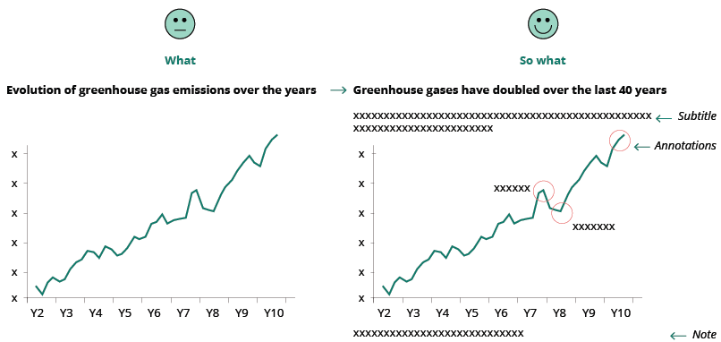
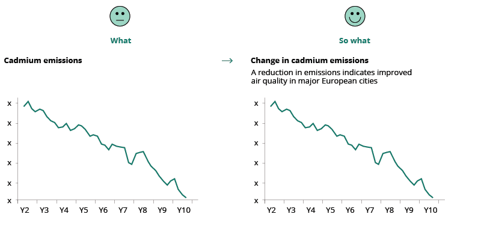
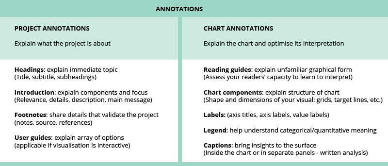
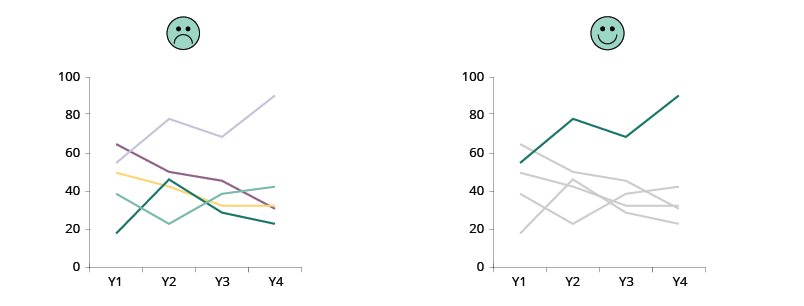
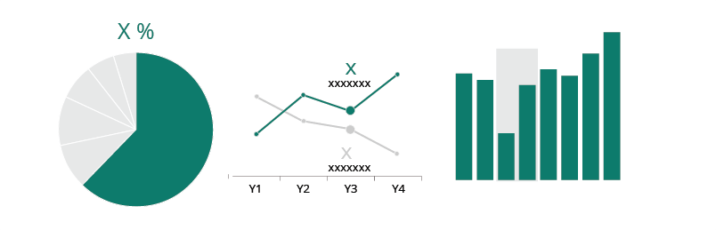
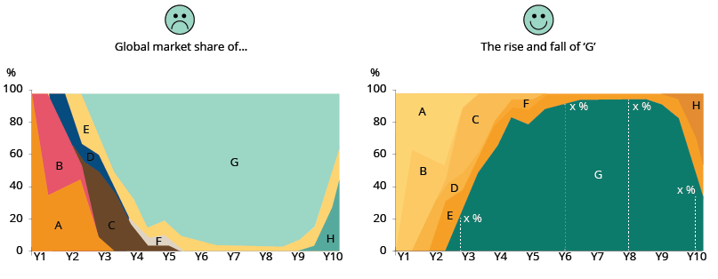
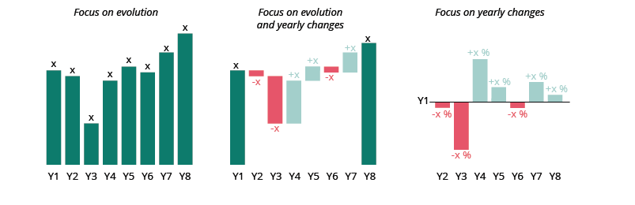
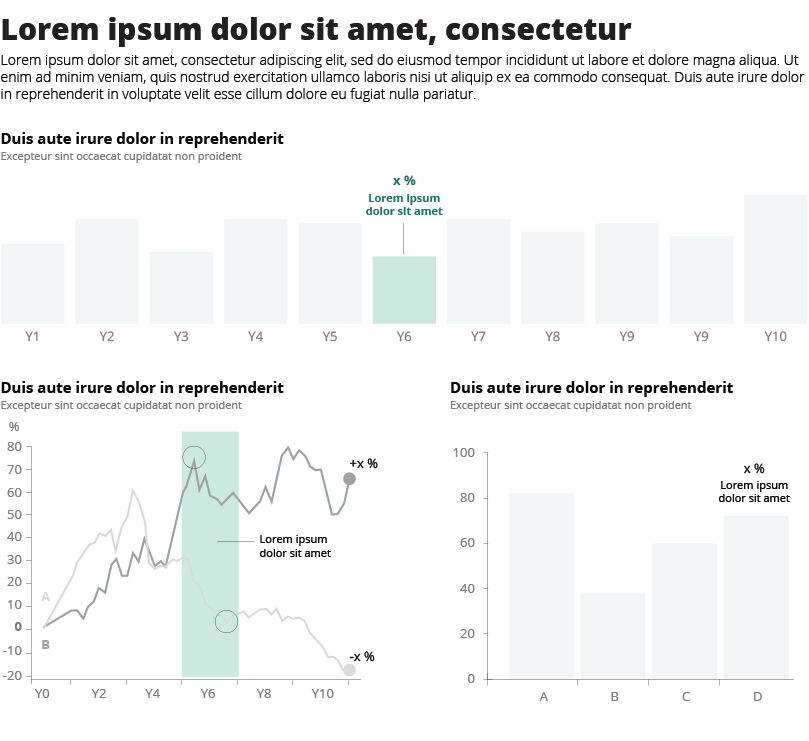

---

### Do tell the ‘why’ and ‘how’: annotations.

:::tip

Use a descriptive chart title and other annotations that not only describe **what** is being measured, but also **why** the reader should care and **how** to read the chart. This will avoid misinterpretation and save time for the chart reader.

:::

The title of your visualisation is the first thing the reader will see so it needs to clearly state **what** is being measured. Include information in the title about the insight the reader will gain from the visual. This tells the reader **why** you are showing it, allowing for a better comprehension of the chart. Sometimes it is helpful to add text that explains **how** to read the chart, even if it is simple (e.g., Is this trend positive or negative?). Further details may be revealed through other annotations that try to answer to the reader’s curiosity (e.g., Why is there a peak/decline there? What happened at this time that may have triggered this change?). Annotations will give a deeper understanding of the content. (See Improving visualisation readability – annotations).

Titles, subtitles, captions, notes and charts work together to convey the chart’s key message and should be written in plain **language**, so avoid **acronyms**.

### Title
Depending on the data and target audience, the title can adopt different styles:

- **Descriptive title** (appropriate for technical audiences): gives a neutral overview of the analysis to come (example).
- **Definitive statement** (suitable for general audiences): clearly communicates your message and the insights (example)
- **Question** (suitable for non-technical audiences): posing a clear question in your title and providing an answer to it will make data more accessible for your audience (example).

<!-- PICTURE -->

### Subtitle
The subtitle can be used to state your key message efficiently, reflecting the insight derived from your analysis.

<!-- PICTURE  -->

### Annotations

Text may not be the most interesting part of a visualisation but getting it right can significantly improve its readability and provide additional detail and depth. Good annotations make it much easier for those with no prior — or limited — knowledge of the visualised data set. In broad terms, there are two types of annotation: project annotations and chart annotations. See image below:

<!-- PICTURE  -->

**More about annotations**

[The Atlas of Sustainable Development Goals](https://openknowledge.worldbank.org/handle/10986/29788) 2018 makes massive use of descriptive titles and annotations. [Here](https://www.youtube.com/watch?t=15947&v=s24eYh2_1X8&feature=youtu.be) is the presentation of the report to the EU DATAVIZ 2019 audience.
<!-- LINK  -->

---

### Do highlight what’s important, tell one story

:::tip

Although it is possible to tell one hundred stories using a single line chart, it makes more sense to focus on just one story.

:::

To better convey a message, you need to guide your audience to the data being analysed. The first step is to have a title that focuses on your insight [(See Tell ‘why’ and ‘how’)](#do-tell-the-why-and-how-annotations). Then you can graphically highlight your data, keeping other data in the background to give context and allow comparisons.

<!-- LINK AND PICTURE -->

The same can be done in all sorts of charts.
<!-- PICTURE  -->

Sometimes you may need to adjust the chart a bit, to let the story emerge.
<!-- PICTURE  -->

At other times, you might need to opt for a different chart type that better enhances the reader‘s focus.
<!-- PICTURE  -->

### Hierarchy of the information

<!-- PICTURE  -->

Consider how your audience will scan and read the visualisation.

If many data are displayed, make wise use of **white space** to separate and group the information. Use **text formatting** to give the desired hierarchy to the content and apply **colours** intentionally to highlight the focus of the data visualisation.

<!-- PICTURE  -->
