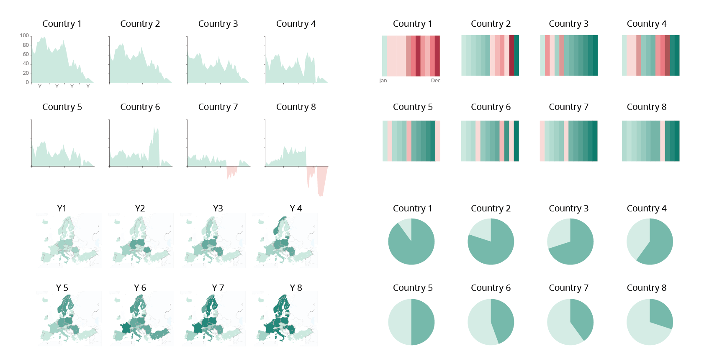

---

### Tables are preferable to graphics for many small data sets  
> Tables are clearly the best way to show the exact numerical values, although the entries can also be arranged in semi-graphical form. Tables are preferable to graphics for many small data sets... Tables also work well when the data presentation requires many localised comparisons... One supertable is far better than a hundred little bar charts.  
> ** *Edward R. Tufte* **

<!-- QUOTES  -->

‘A chart is worth more than ten thousand words' but, on the other hand, graphical representation is a less rich source of information compared, for instance, to a good old table.

In most cases, a chart and a table are complementary, and both should be used in data representation: figures in the table show the analysis of the phenomena in question, while a graphical representation provides a synthesis, allowing for integral and clear understanding.

### Exploratory/explanatory: do choose the right format (flow chart)

<!-- PICTURE  -->

### Static or interactive?

If you are publishing a visualisation on the website, you may opt for a static or an interactive chart. The first variable that influences the choice is the target audience (see [Exploratory/explanatory: choose the right format](#exploratoryexplanatory-do-choose-the-right-format-flow-chart)). 

Static charts are often an adequate option because they are easy to access and do not come with the risk of display issues on your browser or other apps.

But sometimes it is strongly recommended to use the interactive version when:

- there are **many categories**, and consequently many colours (see [Don't use more than (about) six colours](../make-charts-easy-to-read/#dont-use-more-than-about-six-colours)) (Example 1);
- if, due to lack of space, the **labels are not visible** (Example 2);
- if the **values are so divergent** that some of them would not be visible (Example 3);
- and naturally, if there is a need to **sort the values** or filter the information.

<!-- PICTURE  -->

If the visualisation is for a PDF publication or a PowerPoint slide and you need to produce a static chart, you may consider presenting your data in a different way to avoid the issues mentioned above.

<!-- PICTURE  -->

### Do choose the chart type wisely

Choose the chart type depending on what you want to show. Get to know the pros and cons of each chart type.

Before you start charting, take a step back and ask yourself what it is you want to show. Choose the right chart type that is best for finding specific patterns and gaining possible new insight in your data.

**Online tools**
[The Data Visualisation Catalogue](http://www.datavizcatalogue.com/)
[Dataviz Project](https://datavizproject.com/)
[Decision diagram](http://www.labnol.org/software/find-right-chart-type-for-your-data/6523/)
[One chart at the time](https://www.youtube.com/playlist?list=PLfv89tPxlTiVIrwuSBCISiBaGSH1CJR5-) (YouTube series of videos)

<!-- LINKSSSSS  -->

### Bar chart: do use the full axis and avoid distortion
For bar charts, the numerical axis (often the y-axis) must start at zero. 

:::tip

Use the full axis for bar charts. Our vision is very sensitive to the area of bars and we draw inaccurate conclusions when those bars are truncated.

:::

<!-- PICTURE  -->

If you need to show data details that are not visible when using the full axis, then the original chart with full axis can be accompanied with a ’zoomed-in chart‘, a so called ’panel chart' in Excel. See example below:

<!-- PICTURE  -->

**More reading**

http://peltiertech.com/WordPress/broken-y-axis-in-excel-chart/

Making these charts interactive will solve many of the issues stated above. For example, the user would be able to mouse-over a column and get the exact value, filtering out some categories or sorting the columns according to their values for easier comparison.

**More about bar charts**

[Paired bar charts](https://www.youtube.com/watch?v=zqKhXmB8QV4&list=PLfv89tPxlTiVIrwuSBCISiBaGSH1CJR5-&index=3) (YouTube video 7:49); [Stacked bar charts](https://www.youtube.com/watch?v=UC3NTIUPIM0&list=PLfv89tPxlTiVIrwuSBCISiBaGSH1CJR5-&index=4) (YouTube video 3:29); [Pyramid chart](https://www.youtube.com/watch?v=TJabF5HxEmE&list=PLfv89tPxlTiVIrwuSBCISiBaGSH1CJR5-&index=24) (YouTube video 8: 13). These videos present the basics, including some interesting reflections on the bar charts.

<!-- LINKS -->

#### Pie charts: cons (and pros)

The human brain thinks linearly: we can easily compare lengths/heights of line segments but when it comes to angles and areas most of us can't judge them well. Therefore, try to avoid the use of pie charts when comparing many categories or when categories have similar values.

<!-- PICTURE  -->

However, pie charts do work well to display a total and shares thereof, and they are readable if they display only a **few categories** (maximum 5-6). Other good practices are: to **sort** the values in a clockwise manner according to your communication aim; to have the **labels** close to the pie chart (avoid unnecessary effort from the reader); and to use the colours wisely or even use only one **colour** if the pie chart has labels (to eliminate redundancy). With a specific communication aim, a pie chart with many slices can be used to highlight the biggest or the smallest share.

<!-- PICTURE  -->

If you want readers to compare the shares of a total, bar charts and stacked bar charts are better alternatives (See pros and cons of area charts).

<!-- PICTURE  -->

**More about pie charts**

Pie Charts with Robert Kosara: a [video (4:58)](https://www.youtube.com/watch?v=Tg9zFIQy6l0) and his detailed [study](https://kosara.net/papers/2016/Skau-EuroVis-2016.pdf)

[What is a pie chart](http://www.storytellingwithdata.com/blog/2020/5/14/what-is-a-pie-chart)?

[What to consider when creating pie charts](https://academy.datawrapper.de/article/127-what-to-consider-when-creating-a-pie-chart)

[5 unusual alternatives to pie charts](https://www.tableau.com/about/blog/2019/1/5-unusual-alternatives-pie-charts-100071)

<!-- LINKS  -->

### Small multiples

Small multiples are an elegant and efficient way to display many data and to avoid cluttering in one single chart. They provide a narrative about the change displayed (if time is represented) and an overview that doesn’t sacrifice the details.

<!-- PICTURE  -->

For maps, small multiples may also convey the message much better than an animation, so they are a good alternative to interactive visualisations

<!-- PICTUREs  -->

See other examples of when a [small multiple chart is the best alternative to a map](http://junkcharts.typepad.com/junk_charts/2014/02/small-multiples-with-simple-axes.html).

Good practice is to:

- order the categories intentionally to show trends or ranking;
- possibly use a common scale;
- use a simple chart type;
- use the same colours for all charts.
  

**More about small multiples**

[Better Know a Visualization: Small Multiples](https://www.juiceanalytics.com/writing/better-know-visualization-small-multiples)

[How to Make Interactive Linked Small Multiples](https://flowingdata.com/2014/10/15/linked-small-multiples/)

<!-- links  -->

### Stacked charts are difficult for comparing data

Stacked area charts display cumulative trends over time. They are a good choice if showing the **total** is as important as showing its shares and they work best when there is a **large difference** between the values.

However, while the contribution to the total of the lowermost attribute is well readable, it is **difficult to appreciate** other attributes that are far from the reference line. So, it is not the right choice if you want to compare the size of different shares with each other, or if you have many shares.

<!-- PICTURE  -->

The choice of chart depends on the focus.

<!-- PICTURE  -->

If you want to show the trend of each share, opt for an individual area chart or a line chart.

**More about area charts (stacked area and stacked bar charts)**

[Area graphs](https://www.youtube.com/watch?v=ClMqlGT4V-M&list=PLfv89tPxlTiVIrwuSBCISiBaGSH1CJR5-&index=18) (video 8:03)

[What to consider when creating area chart](https://academy.datawrapper.de/article/128-what-to-consider-when-creating-area-charts)

<!-- links  -->

### Dual axis charts, pros and cons

There is a debate around dual axis charts. They are mainly used to **highlight some relation** in the trend of two data sets with different units of measure or to compare two data series with the same measure, but different magnitudes.

The advantage of these charts is that they illustrate a lot of information with limited space. The downside is that they are often not easy to read, and they could even lead to misleading interpretations.

Best practice:

- To avoid confusion, the data need to be clearly referable to their own axis with the help of colours and text.
- To avoid misleading interpretation, when using the same unit, the axes should be synchronised.

<!-- PICTURE  -->

If you want to keep different scales to see the evolution in detail, you can opt for side-by-side charts and use annotations to highlight possible correlations between the two series.

<!-- PICTURE  -->

If you want to keep both data series in one chart, you can create an indexed chart. An indexed chart that does not tell anything about absolute numbers but shows the relative change in data series over time.

<!-- PICTURE  -->

Another alternative to the dual axis, is the [connected scatterplot](https://www.youtube.com/watch?v=Muzo3ueHsyU).

**More about dual axis charts:**

[Dueling with axis: the problems with dual axis charts](https://digitalblog.ons.gov.uk/2019/07/03/dueling-with-axis-the-problems-with-dual-axis-charts/)

[The Do’s and Don’ts of Dual Axis Charts](https://datahero.com/blog/2015/04/23/the-dos-and-donts-of-dual-axis-charts/) 

[Why not to use two axes, and what to use instead](https://blog.datawrapper.de/dualaxis/#fn2) 

[Dual axis charts with Nigel Hawtin](https://www.youtube.com/watch?v=-_9uG0bKgp8&list=PLfv89tPxlTiVIrwuSBCISiBaGSH1CJR5-&index=16)

