---

### Do use clear language and avoid acronyms

Try to use clear language in your chart title and descriptions. Avoid acronyms like ‘MS’ and use the extended form ‘Member State’ or even better, simply ‘Country’. It is OK to use well-known abbreviations like EU or GDP, or those your audience understand clearly. 

### Do remove any visual clutter (increase data-ink ratio, Tufte’s principle)

> Perfection is achieved not when there is nothing more to add, but when there is nothing left to take away.
> ** *Antoine de Saint-Exupery* **
<!-- quote  -->

As shown in the example below, it is important to remove any visual clutter to let the content stand out.

- Remove the background
- Remove (or lighten) the grid
- Remove the % on the Y axis, if clarified on top
- Remove the title of the X axis, if not necessary
- Remove the legend if the bars can be labelled
- Remove the colours if not necessary
- Remove any graphical effect (shadow)

<!-- picture  -->
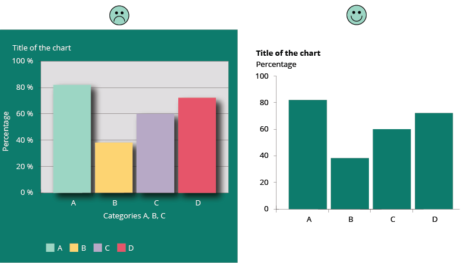

Read more about Data-Ink ratio and [Tufte's principles](http://thedoublethink.com/2009/08/tufte%E2%80%99s-principles-for-visualizing-quantitative-information/).
<!-- link  -->

### Do rotate bar chart when category names are too long

<!-- picture  -->
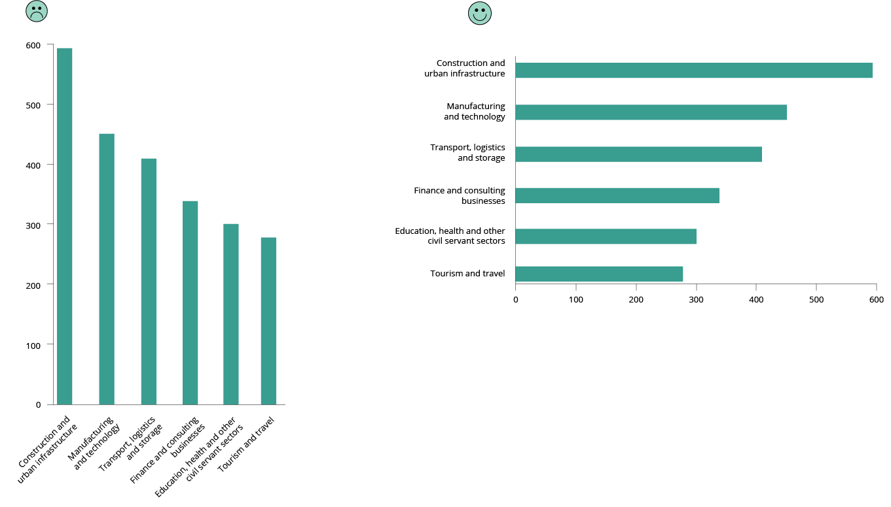

**More about horizonal bar charts**

[My penchant for horizontal bar charts](http://www.storytellingwithdata.com/2012/10/my-penchant-for-horizontal-bar-graphs.html) by Cole Nussbaumer
<!-- link  -->

### Don’t use a legend when you have only one data category

If there is only one value category plotted in your chart, then there is no need to have a legend. The necessary information can be included in the title instead. Alternatively, you can label the axis directly.

<!-- picture  -->
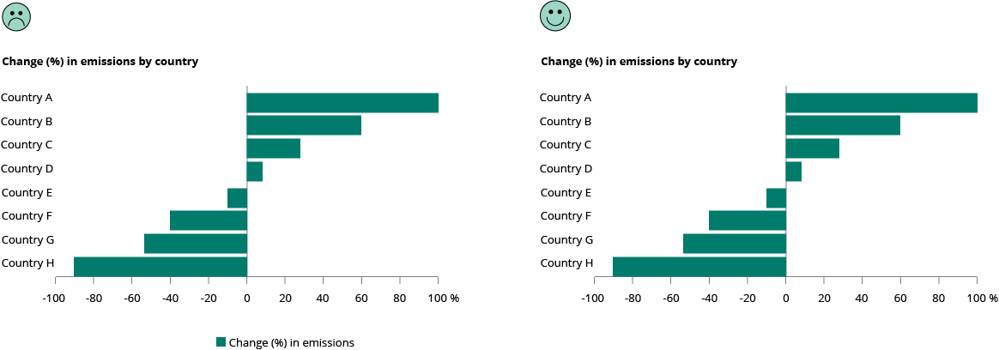

### Do use direct labelling wherever possible, avoiding indirect look-up

**If possible**, label lines individually and avoid legends.

<!-- picture  -->
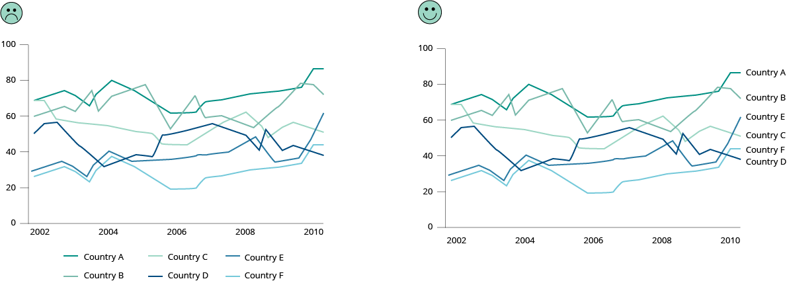

You want to allow instant identification of the lines but looking them up in a legend takes way too much time. Often the legend is below the chart and its elements are in arbitrary order. Instead, place the labels close to the lines.

However, placing a label next to a line could become an issue when multiple lines end at the same point. In that case, place a legend below the chart.

**More about line charts**

[Doing the line charts right](https://www.vis4.net/blog/2012/06/doing-the-line-charts-right/), by Gregor Aisch.
<!-- link  -->

### Do sort your data for easier comparisons

It is more important to give emphasis to the data itself and sort your chart by **data attributes**, rather than non-data attributes (e.g., labels like country names).

With the data sorted, a proper comparison across the many bars is easier to do, as is finding a country in the list after a quick scan.

<!-- picture  -->
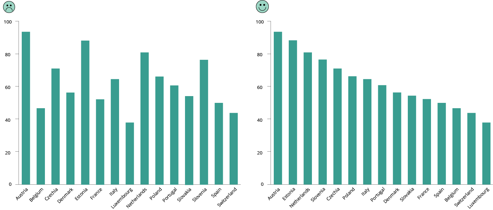

Pie charts work better when presented with sorted data values. Start at 12 o’clock with the largest slice and work clockwise. In this way, it is much easier to understand relations between parts — what is bigger and what is smaller — even when values are not readable, or areas are very similar.

<!-- picture  -->
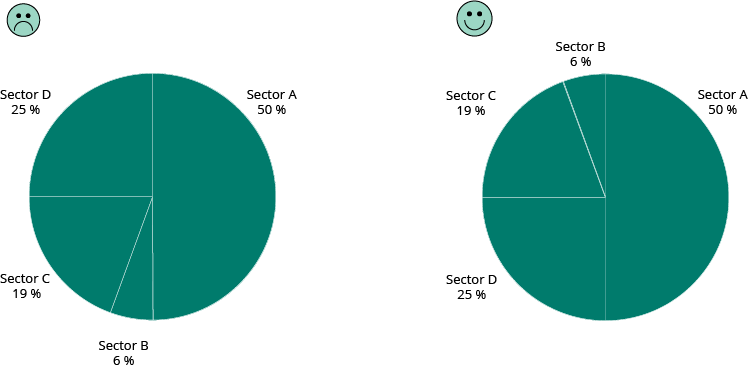

If the chart is interactive, give the user the possibility to change the default sort order and a way to filter out data to compare only a few categories.

### Don't use more than (about) six colours

Colour categorisation is not random, and the centres of basic colour terms are very similar in all languages. Using colour categories that are relatively universal makes it easier to see differences between colours. The figure below shows the order of appearance of colour names in languages around the world. The order is fixed, with the exception that sometimes yellow is present before green and sometimes the reverse is the case.
[Source: Berlin and Kay (1969)](https://files.eric.ed.gov/fulltext/ED019655.pdf)

<!-- picture and link  -->
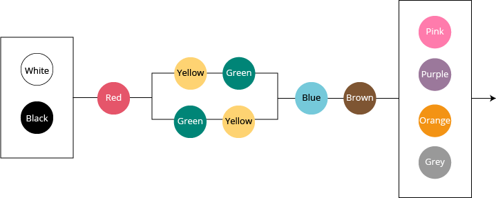

Use different colours to represent different categories (e.g., private/public, types of pollutant), not different values in a range (e.g., age, temperature). See qualitative colour palette below.

If you want colour to show a numerical value, use a range that goes from light to dark in one of the universal colour categories. See sequential colour palette below.

If you need to represent diverging numeric values (from hot to cold, from good to bad, etc.), use two colours as shown in the diverging colour palette example. 

<!-- picture  -->
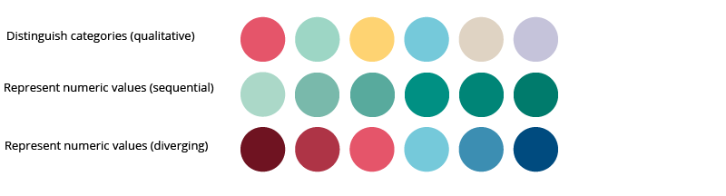

Do not use rainbows for range values.

<!-- picture  -->
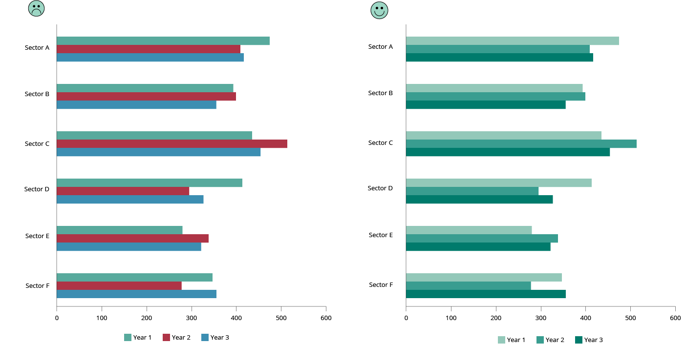

**More about colour use**
[Which colour to use in visualisation](https://blog.datawrapper.de/which-color-scale-to-use-in-data-vis/)

[When to use qualitative/quantitative colour scales](https://blog.datawrapper.de/quantitative-vs-qualitative-color-scales/)

[When to use sequential/diverging colour scales](https://blog.datawrapper.de/diverging-vs-sequential-color-scales/)

[When to use classed/unclassed colour scales](https://blog.datawrapper.de/classed-vs-unclassed-color-scales/)

[EEA Corporate colour guidelines](https://eea1.sharepoint.com/sites/Editing/Document%20Library/EEA%20COLOURS%202021_Feb%202021.pdf)
<!-- link  -->

### Do be aware of colour blindness (colour vision deficiency)

Colour blindness, also known as colour vision deficiency (CVD) affects approximately 8 % of men and 0.5 % of women in the world. There are an estimated 300 million colour blind people in the world. Below, is an example of how someone with colour blindness would perceive a chart.

<!-- picture  -->
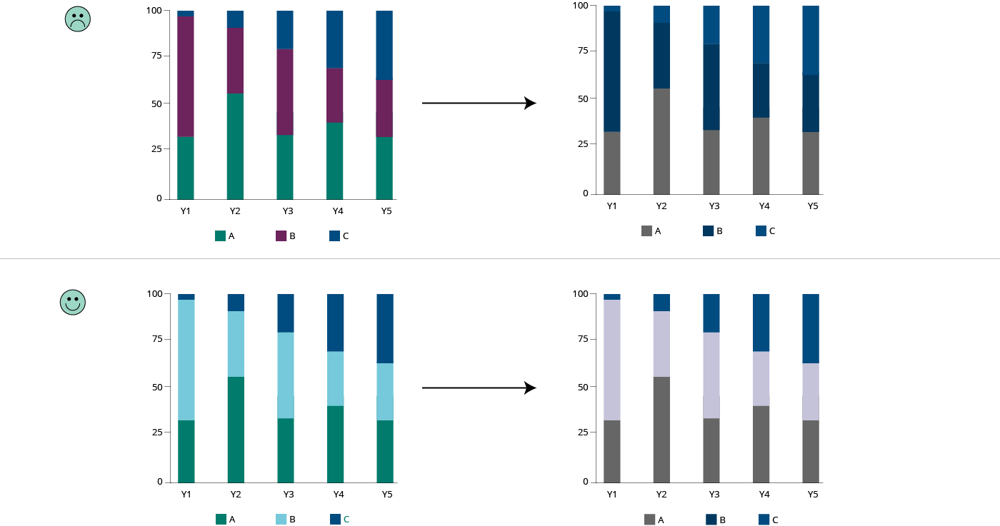

Most colour-blind people can detect **contrast**: using a combination of light and dark colour makes your design more accessible.

<!-- picture  -->
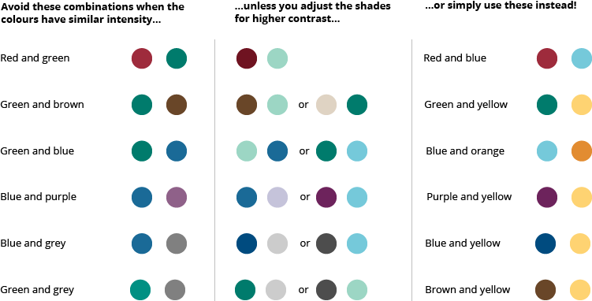

Do not rely **just** on colour to communicate. Different shapes, patterns and textures can help distinguish between different design elements in your visualisation.

<!-- picture  -->
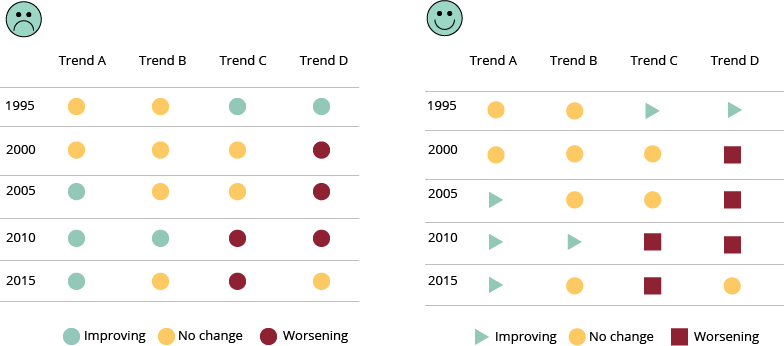

One simple way to optimise your design is to avoid using any colour combinations. Use a **monochromatic** palette in different shades. 

<!-- picture  -->
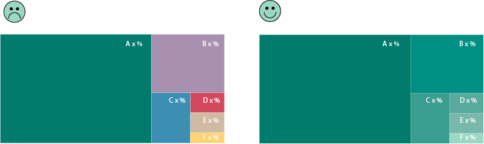

There are easy-to-use colour deficiency simulators online to help you test your visualisation, as well as extensions you can add to your browser:

[Coblis — Colour Blindness Simulator](https://www.color-blindness.com/coblis-color-blindness-simulator/)

[Spectrum - Google Chrome add-on](https://chrome.google.com/webstore/detail/spectrum/ofclemegkcmilinpcimpjkfhjfgmhieb?hl=en)

[Colorblinding – Chrome extension](https://chrome.google.com/webstore/detail/colorblinding/dgbgleaofjainknadoffbjkclicbbgaa?hl=en)
<!-- link  -->
