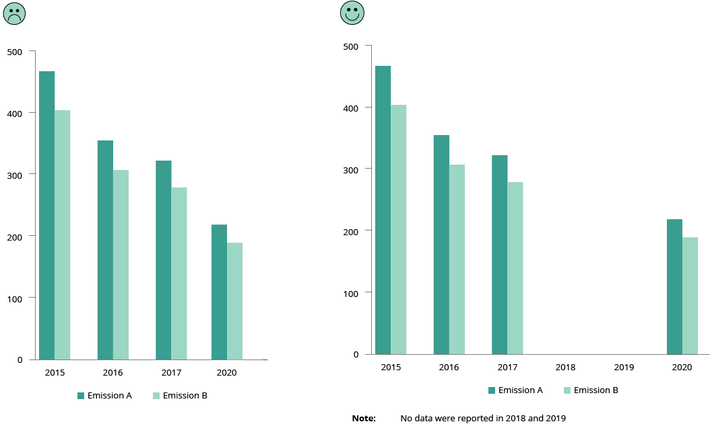
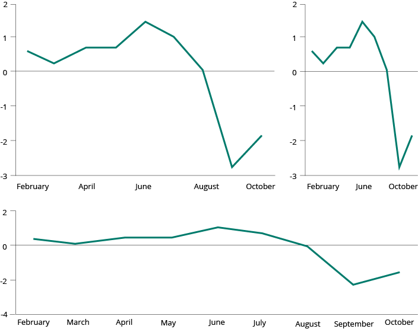
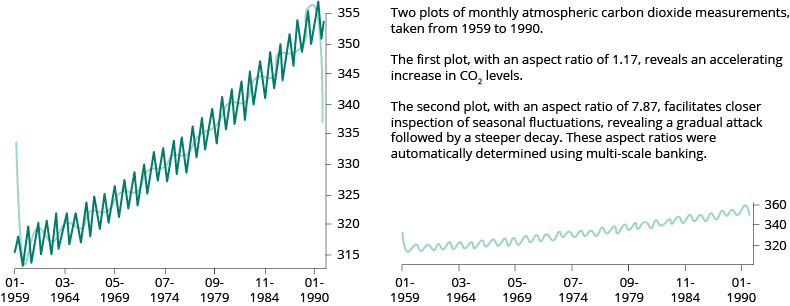
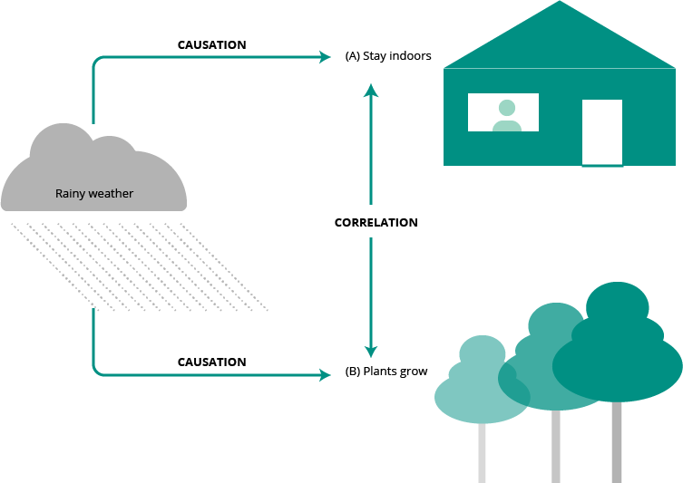
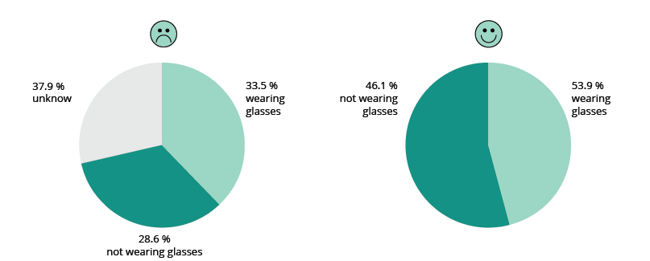
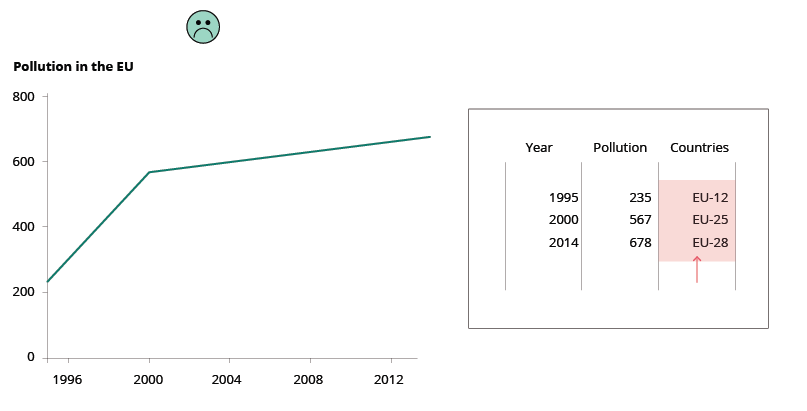
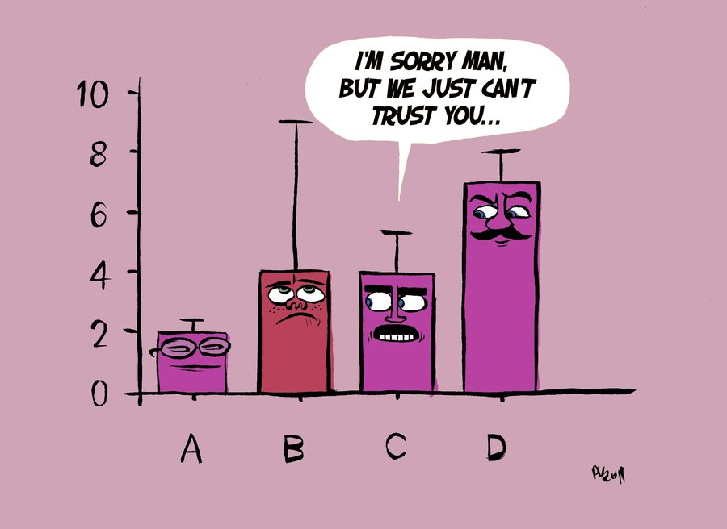

---

### Do use consistent intervals on axis (be transparent on data gaps)

Be clear when some data are missing. Explain the reason why. Use the full axis and do not skip values when you have numerical data.

<!-- picture -->

### Do use proper aspect ratio to minimise dramatic slope effects

The slope of a line chart should be close to 45 degrees for better perception.

In the example below, the same data are presented in three ways. The slope reflects the scales used on the two axes:

<!-- picture -->

However, in some cases there can be legitimate reasons for not sticking to banking to 45 degrees. For example, to analyse the data that reveal certain patterns, which otherwise would not be visible in the 45-degree slope. See example below:

<!-- picture -->

**More about this topic**
https://eagereyes.org/basics/banking-45-degrees

http://vis.berkeley.edu/papers/banking/2006-Banking-InfoVis.pdf

### Don't confuse correlation with causation
Quite often superimposing time series of two different measurements will show a strong correlation. It is an easy mistake to confuse correlation with causation. Bias can make us conclude that one thing must cause another if both change in the same way and at the same time.

For example, if you plot two different data series (A and B) on the same chart, you may notice that both follow a similar pattern over time. It is extremely hard, if not impossible, to prove that A caused B or vice versa. There are so many third unplotted factors that may influence both A and B. Only a large profound statistical-based study on all factors can give some indication of causation, if any exists.

<!-- picture  -->

**More about this topic**

https://towardsdatascience.com/correlation-is-not-causation-ae05d03c1f53

[Method for identify true correlation by removing the time-series data](http://junkcharts.typepad.com/junk_charts/2013/06/de-noising-data.html)

https://codingwithmax.com/correlation-vs-causation-examples/

<!-- link  -->

### Do adjust for inflation in long-time series

:::tip

When using economic values in your charts, you must be careful about adjusting the value according to inflation

:::

### Do be careful about how you treat ‘no-data/missing data’ 

Take the following chart as an example of the results of certain observations made on the street. You want to see how many people walking by are wearing glasses (X) or not wearing glasses (Y) in a specific time frame. When you are not able to identify either, you mark it as ‘unknown’. After 1 000 observations you stop collecting data.

<!-- picture  -->

The left chart says that 33.5 % wore glasses (X) and 28.6 % did not (Y), while 37.9 % were unknown (the missing data). The issue with the chart above is that the unknown must not be treated as a third category that is different from the other two. The unknown contains both X and Y, most probably with the same distribution. Therefore, the missing data must be removed and only reported separately. This is standard practice in all statistical surveys. On the right, the chart is corrected without the unknown. In this case, an indication of a margin of error would also help.

### Don't compare apples with oranges

This rule sounds trivial, but it can be quite difficult to respect when things may appear identical. For example, imagine the following trend analysis of CO2 emissions over time in Europe. From a simplistic point of view, the trend over time for the EU from 1995 to 2014 all looks fine. However, the EU did not consist of the same countries over time and therefore the EU-12 cannot be compared with the EU-25 or the EU-28. The countries that formed the EU-12 are not statistically equal to the countries that were part of the EU-28. This is comparing apples with oranges!

<!-- picture  -->

### Do show the level of confidence

Tell your audience how confident you are in your assertions by including error bars any time you use data to make an argument.

<!-- picture -->

Source: [The importance of uncertainty, Berkeley Science review](http://sciencereview.berkeley.edu/importance-uncertainty/).

More about this topic

[Visualizing the Uncertainty in Data | FlowingData](https://flowingdata.com/2018/01/08/visualizing-the-uncertainty-in-data/)

[Visualizing uncertainty still unsolved problem | FlowingData](https://flowingdata.com/2013/07/10/visualizing-uncertainty-still-unsolved-problem/)

[References for visualising uncertainty - Visualising Data](https://www.visualisingdata.com/2015/02/references-visualising-uncertainty/)

[What are error bars, anyway, Berkeley Science review](https://berkeleysciencereview.com/2014/06/errorbars-anyway/)

