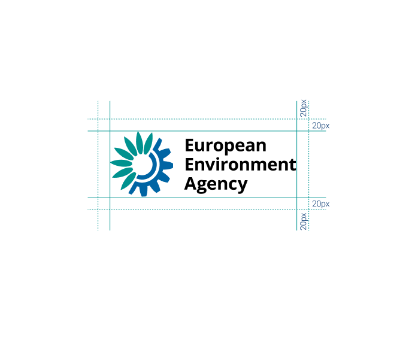

An invisible clear space around the logo should be left clear. No other graphic elements should be placed within this area. It is defined using the width of the"M" from the logotype applied all round.

