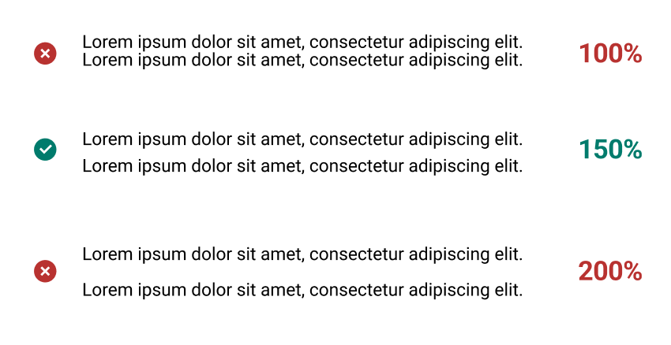

 

### Primary Font: Roboto

We use Roboto as our Primary font. Roboto allows letters to take up as much space as it needs and ultimately, making for an improved experience for the reader. 
We use Arial as a web safe alternative font. It is similar in character and style to Roboto typeface and is a commonly available system font.

### Weight

Font weight is the thickness of a font's stroke, with various weights used to differentiate content hierarchy. The bold style emphasizes the importance in comparison with the regular font style in the font family. 
We can use weights strarting from 300 (Light) up to 700 (Bold). Usually, the bold style is assigned to headings. Regular text is used for body text.

<h4 style={{ fontWeight: '300', display: 'flex', marginBlock: '10px' }}>Light 300</h4>
<h4 style={{ fontWeight: '400', display: 'flex', marginBlock: '10px'  }}>Regular 400</h4>
<h4 style={{ fontWeight: '500', display: 'flex', marginBlock: '10px' }}>Medium 500</h4>
<h4 style={{ fontWeight: '600', display: 'flex', marginBlock: '10px'  }}>SemiBold 600</h4>
<h4 style={{ fontWeight: '700', display: 'flex', marginBlock: '10px'  }}>Bold 700</h4>

 

### Line height

Line spacing is commonly measured as a percentage of font size. Conventional wisdom is that line spacing of 130%-150% is ideal for readability. In fact, anything from about 120% up to 200% is acceptable, 
but 150% tends to be the most quoted sweet spot (and a WCAG recommendation). You should experiment to see what looks best with your text. The line-height value is always divisible by 4 to support the grid.

 

 

### Letter spacing

Letterspacing (also known as character spacing or tracking ) is the adjustment of the horizontal white space between the letters in a block of text. Unlike kerning, which affects only designated pairs of letters, letterspacing affects every pair. 
By adjusting letter-spacing to the environment you are working with you will help readers consume your information faster, and more efficiently. The fun part is that they won’t even notice it!

#### Headings -1.5%
#### Body 0%
#### Caption and Small text 1%

 

### Text color

Color also plays a key role in an interface’s typographic hierarchy, often by established types like:  
- Brand colors and supplementary colors, for most interface text whether body or heading.  
- Interactive, not just for links but also flat buttons, tab labels, and more  
- Disabled, often resulting is especially lower contrast treatments  
- Error, usually red, for the highest contrast with its surroundings  

 

### Line length
Line-length is the number of characters displayed in a single line. Lines that are too long or too short can distract readers. For readability, limit to **no more than 80 characters including spaces for desktop**. 
Line length **for mobile is recommended to use 40 to 60 characters** including space per line.

 

### Base Font Size
We set 16px (1rem) as the base font size for body text to ensure readability. It is the default font size for most browsers.

 

## <u> Desktop Styles </u> 

    

        

            <h1>Heading 1</h1>
        

        

            <b>Font: Roboto   Size: 48px or 3rem    Letter spacing: -1.5%</b>
        

    

        

            
Heading 1 (Archivo)

        

        

            <b>Font: Archivo   Size: 48px or 3rem      Letter spacing: -1.5%</b>
        

    

    

        

            <h2>Heading 2</h2>
        

        

            <b>Font: Roboto   Size: 40px or 2.5rem    Letter spacing: -1.5%</b>
        

    

    

        

            <h3>Heading 3</h3>
        

        

            <b>Font: Roboto   Size: 36px or 2rem    Letter spacing: -1.5%</b>
        

    

    

        

            <h4>Heading 4</h4>
        

        

            <b>Font: Roboto   Size: 24px or 1.5rem    Letter spacing: -1.5%</b>
        

    

    

        

            <h5>Heading 5</h5>
        

        

            <b>Font: Roboto   Size: 20px or 1.25rem    Letter spacing: -1.5%</b>
        

    

    

        

            <body>Body</body>
        

        

            <b>Font: Roboto   Size: 16px or 1rem    Letter spacing: 0%</b>
        

    

      

        

            <caption>Caption</caption>
        

        

            <b>Font: Roboto   Size: 14px or 0.875rem    Letter spacing: 1%</b>
        

    

      

        

            <smalltext>Small text</smalltext>
        

        

            <b>Font: Roboto   Size: 12px or 0.75rem    Letter spacing: 1%</b>
        

    

## <u> Mobile Styles </u> 

    

        

            
 Heading 1

        

        

            <b>Font: Roboto   Size: 30px or 1.875rem    Letter spacing: -1.5%</b>
        

    

    

        

            
 Heading 1 (Archivo)

        

        

            <b>Font: Archivo   Size: 30px or 1.875rem    Letter spacing: -1.5%</b>
        

    

    

        

            
 Heading 2

        

        

            <b>Font: Roboto   Size: 24px or 1.5rem    Letter spacing: -1.5%</b>
        

    

    

        

            
 Heading 3

        

        

            <b>Font: Roboto   Size: 20px or 1.25rem    Letter spacing: -1.5%</b>
        

    

      

        

            
 Heading 4

        

        

            <b>Font: Roboto   Size: 18px or 1.125rem    Letter spacing: -1.5%</b>
        

    

    

        

            <body>Body</body>
        

        

            <b>Font: Roboto   Size: 16px or 1rem    Letter spacing: 0%</b>
        

    

    

        

            <caption>Caption</caption>
        

        

            <b>Font: Roboto   Size: 14px or 0.875rem    Letter spacing: 1%</b>
        

    

    

        

            <smalltext>Small text</smalltext>
        

        

            <b>Font: Roboto   Size: 12px or 0.75rem    Letter spacing: 1%</b>
        

    

## Typography tokens 

### Weight

| Token name         | Value           | Style | 
| ------------------ | ----------------| -------------- |
| font-weight-1      | 100             | Thin              |
| font-weight-2      | 200             | Light             |
| font-weight-3      | 300             | Book              |
| font-weight-4      | 400             | Regular           |
| font-weight-5      | 500             | Medium            |
| font-weight-6      | 600             | SemiBold          |
| font-weight-7      | 700             | Bold              |
| font-weight-8      | 800             | ExtraBold         |
| font-weight-9      | 900             | Black             |

### Line height

| Token name         | em              |  
| ------------------ | ----------------| 
| font-lineheight-00 | .95             |
| font-lineheight-0  | 1.1             |
| font-lineheight-1  | 1.25            |
| font-lineheight-2  | 1.375           |
| font-lineheight-3  | 1.5             |
| font-lineheight-4  | 1.75            |
| font-lineheight-5  | 2               |

### Letter spacing

| Token name             | em              |  
| ---------------------- | ----------------| 
| font-letterspacing-000 | -.02            |
| font-letterspacing-00  | -.015           |
| font-letterspacing-0   | -.005           |
| font-letterspacing-1   |  .005           |
| font-letterspacing-2   |  .01            |
| font-letterspacing-3   |  .02            |
| font-letterspacing-4   |  .05            |
| font-letterspacing-5   |  .1             |

### Font size

| Token name             | rem              |  
| ---------------------- | ---------------- | 
| font-size-00           | .75              |
| font-size-0            | .875             |
| font-size-1            |  1               |
| font-size-2            |  1.1             |
| font-size-3            |  1.25            |
| font-size-4            |  1.5             |
| font-size-5            |  2               |
| font-size-6            |  2.5             |
| font-size-7            |  3               |
| font-size-8            |  3.5             |

### Font size fluid

| Token name             | Value                |  
| ---------------------- | -------------------  | 
| font-size-fluid-0      | .75rem, 2vw, 1rem    |
| font-size-fluid-1      | 1rem, 4vw, 1.5rem    |
| font-size-fluid-2      | 1.5rem, 6vw, 2.5rem  |
| font-size-fluid-3      | 2rem, 9vw, 3.5rem    |