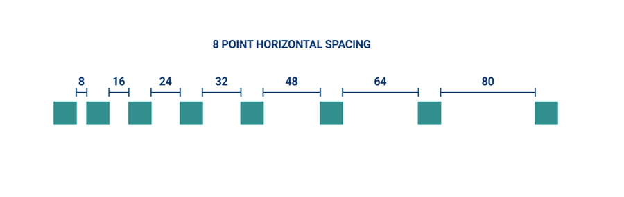
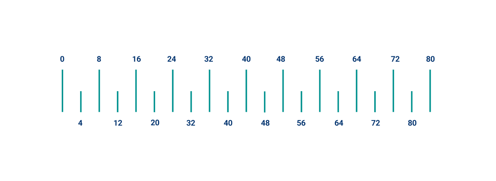

To ensure that layouts are visually balanced, most measurements align to 8px, which corresponds to both spacing and the overall layout. Components are sized in 8px increments, ensuring a consistent visual rhythm across each screen.
Smaller elements, such as icons, can align to a 4px grid, while typography can fall on a 4px baseline grid, meaning that each line’s typographic baseline is spaced in increments of 4px from its neighbor.

## Spacing Gaps in pixels
| Token name         | Pixels           | Typically used | 
| ------------------ | ---------------- | -------------- |
| space-025            | 1px              |                |
| space-05             | 2px              |                |
| space-1              | 4px              |                |
| space-2              | 8px              |                |
| space-3              | 12px             |                |
| space-4              | 16px             |                |
| space-5              | 20px             |                |
| space-6              | 24px             |                |
| space-7              | 28px             |                |
| space-8              | 32px             |                |
| space-9              | 36px             |                |
| space-10             | 40px             |                |
| space-11             | 44px             |                |
| space-12             | 48px             |                |
| space-13             | 52px             |                |
| space-14             | 56px             |                |
| space-15             | 60px             |                |
| space-16             | 64px             |                |
| space-17             | 68px             |                |
| space-18             | 72px             |                |
| space-19             | 76px             |                |
| space-20             | 80px             |                |

## Spacing Gaps in rem
| Token name                  | Rem          | Typically used | 
| --------------------------- | ------------ | -------------- |
| rem-space-025            | 0.063rem     |                |
| rem-space-05             | 0.125rem     |                |
| rem-space-1              | 0.25rem      |                |
| rem-space-2              | 0.5rem       |                |
| rem-space-3              | 0.75rem      |                |
| rem-space-4              | 1rem         |                |
| rem-space-5              | 1.25rem      |                |
| rem-space-6              | 1.5rem       |                |
| rem-space-7              | 1.75rem      |                |
| rem-space-8              | 2rem         |                |
| rem-space-9              | 2.25rem      |                |
| rem-space-10             | 2.5rem       |                |
| rem-space-11             | 2.75rem      |                |
| rem-space-12             | 3rem         |                |
| rem-space-13             | 3.25rem      |                |
| rem-space-14             | 3.5rem       |                |
| rem-space-15             | 3.75rem      |                |
| rem-space-16             | 4rem         |                |
| rem-space-17             | 4.25rem      |                |
| rem-space-18             | 4.5rem       |                |
| rem-space-19             | 4.75rem      |                |
| rem-space-20             | 5rem         |                |

## Spacing Gaps in em
| Token name                  | Rem          | Typically used | 
| --------------------------- | ------------ | -------------- |
| em-space-025            | 0.063em     |                |
| em-space-05             | 0.125em     |                |
| em-space-1              | 0.25em      |                |
| em-space-2              | 0.5em       |                |
| em-space-3              | 0.75em      |                |
| em-space-4              | 1em         |                |
| em-space-5              | 1.25em      |                |
| em-space-6              | 1.5em       |                |
| em-space-7              | 1.75em      |                |
| em-space-8              | 2em         |                |
| em-space-9              | 2.25em      |                |
| em-space-10             | 2.5em       |                |
| em-space-11             | 2.75em      |                |
| em-space-12             | 3em         |                |
| em-space-13             | 3.25em      |                |
| em-space-14             | 3.5em       |                |
| em-space-15             | 3.75em      |                |
| em-space-16             | 4em         |                |
| em-space-17             | 4.25em      |                |
| em-space-18             | 4.5em       |                |
| em-space-19             | 4.75em      |                |
| em-space-20             | 5em         |                |
