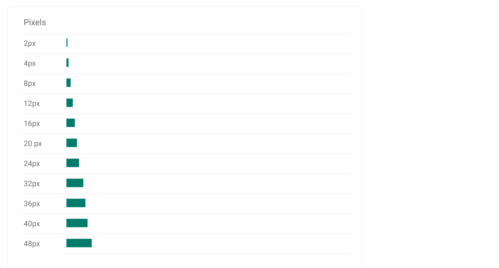
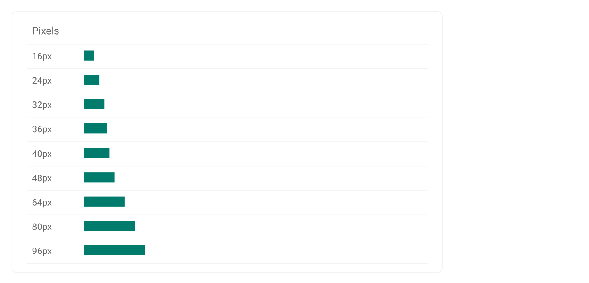

To ensure that layouts are visually balanced, most measurements align to 8px, which corresponds to both spacing and the overall layout.
Consistent spacing creates visual balance that makes the user interface (UI) easier for merchants to scan. Apply consistent spacing to improve the quality of the UI. Components are sized in 8px increments, ensuring a consistent visual rhythm across each screen.
Smaller elements, such as icons, can align to a 4px grid, while typography can fall on a 4px baseline grid, meaning that each line’s typographic baseline is spaced in increments of 4px from its neighbor.

## Principles

<b> Create visual rhythm </b>  
We use incrementally measured spacing to create harmonious arrangements of components and text. This gives the elements a predictable rhythm, which makes the experience as a whole feel intentional and well designed.

   

<b> Precise but flexible </b>  
Beyond mathematical precision, spacing also reacts to the objects it surrounds, giving more space to larger objects, less to small. Optical adjustments can also be made if an element looks off and the spacing needs a nudge to make things feel right.

## Two types of spacing scale

<b> Component Spacing  </b>  
Controls the spacing inside the components.  
For components use smaller increments. ( 4px, 8px, 12px, 16px, 20px, 24px, 32px, 36px, 40px, 48px)

 

<b> Layout Spacing </b>  
Controls space between the components.  
For layout scale use larger increments (16px, 24px, 32px, 48px, 64px, 96px )

 

## Spacing Gaps in pixels
| Token name         | Pixels           | Typically used | 
| ------------------ | ---------------- | -------------- |
| space-025            | 1px              | spacings within a component or between icons and related text               |
| space-05             | 2px              | spacings within a component or between icons and related text               |
| space-1              | 4px              | separate related elements and for small padding               |
| space-2              | 8px              | only for right and left padding of buttons, form elements and horizontal tabs               |
| space-3              | 12px             | to separate unrelated elements or groups and for normal padding               |
| space-4              | 16px             | to separate sub-sections of content              |
| space-5              | 20px             | to separate sub-sections of content               |
| space-6              | 24px             | to separate sub-sections of content              |
| space-7              | 28px             | to separate sections of content              |
| space-8              | 32px             | to separate sections of content            |
| space-9              | 36px             | to separate sections of content               |
| space-10             | 40px             |                |
| space-11             | 44px             |                |
| space-12             | 48px             |                |
| space-13             | 52px             |                |
| space-14             | 56px             |                |
| space-15             | 60px             |                |
| space-16             | 64px             |                |
| space-17             | 68px             |                |
| space-18             | 72px             |                |
| space-19             | 76px             |                |
| space-20             | 80px             |                |
| space-24             | 96px             |                |

## Spacing Gaps in rem
| Token name                  | Rem          | Typically used | 
| --------------------------- | ------------ | -------------- |
| rem-space-025            | 0.063rem     | spacings within a component or between icons and related text               |
| rem-space-05             | 0.125rem     |  spacings within a component or between icons and related text              |
| rem-space-1              | 0.25rem      |  separate related elements and for small padding              |
| rem-space-2              | 0.5rem       |   only for right and left padding of buttons, form elements and horizontal tabs             |
| rem-space-3              | 0.75rem      |   to separate unrelated elements or groups and for normal padding             |
| rem-space-4              | 1rem         |    to separate sub-sections of content            |
| rem-space-5              | 1.25rem      |    to separate sub-sections of content            |
| rem-space-6              | 1.5rem       |     to separate sub-sections of content           |
| rem-space-7              | 1.75rem      |     to separate sections of content           |
| rem-space-8              | 2rem         |     to separate sections of content           |
| rem-space-9              | 2.25rem      |     to separate sections of content           |
| rem-space-10             | 2.5rem       |                |
| rem-space-11             | 2.75rem      |                |
| rem-space-12             | 3rem         |                |
| rem-space-13             | 3.25rem      |                |
| rem-space-14             | 3.5rem       |                |
| rem-space-15             | 3.75rem      |                |
| rem-space-16             | 4rem         |                |
| rem-space-17             | 4.25rem      |                |
| rem-space-18             | 4.5rem       |                |
| rem-space-19             | 4.75rem      |                |
| rem-space-20             | 5rem         |                |
| rem-space-24             | 6rem         |                |

## Spacing Gaps in em
| Token name                  | Rem          | Typically used | 
| --------------------------- | ------------ | -------------- |
| em-space-025            | 0.063em     |      spacings within a component or between icons and related text          |
| em-space-05             | 0.125em     |       spacings within a component or between icons and related text         |
| em-space-1              | 0.25em      |    separate related elements and for small padding            |
| em-space-2              | 0.5em       |    only for right and left padding of buttons, form elements and horizontal tabs            |
| em-space-3              | 0.75em      |    to separate unrelated elements or groups and for normal padding            |
| em-space-4              | 1em         |    to separate sub-sections of content            |
| em-space-5              | 1.25em      |    to separate sub-sections of content            |
| em-space-6              | 1.5em       |     to separate sub-sections of content           |
| em-space-7              | 1.75em      |    to separate sections of content           |
| em-space-8              | 2em         |    to separate sections of content            |
| em-space-9              | 2.25em      |     to separate sections of content           |
| em-space-10             | 2.5em       |                |
| em-space-11             | 2.75em      |                |
| em-space-12             | 3em         |                |
| em-space-13             | 3.25em      |                |
| em-space-14             | 3.5em       |                |
| em-space-15             | 3.75em      |                |
| em-space-16             | 4em         |                |
| em-space-17             | 4.25em      |                |
| em-space-18             | 4.5em       |                |
| em-space-19             | 4.75em      |                |
| em-space-20             | 5em         |                |
| em-space-24             | 6em         |                |
