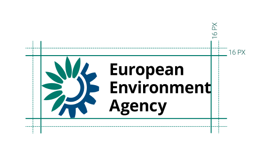

### EEA LOGO

 To ensure consistency, it is important that the EEA logo appears only in the colours specified in these guidelines.

 When applying the logo to images ensure that it is against a light, uncluttered background.

 

 

  

To ensure logo's integrity and visibility, it must always be kept clear of competing text, images or graphic elements. It must be surrounded by a minimum clear space οf 16px as indicated below. 

### EEA LOGO - Dark version

The only time the white version of the EEA logo appears on is against the dark background of the footer. 

 

