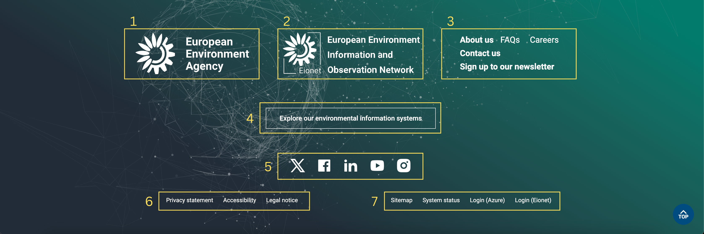

The core footer provides supplementary information such as copyright, legal, privacy, social media, contact information and links to other important sites within the EEA. It is always placed at the bottom of every page. <b> Always use a footer when building your page </b>

### Anatomy

| Νο. | Components                                                   | Mandatory | Description |
| -- | ------------------------------------------------------------ | --------- | --------- |
| 1 | **EEA logo**                                                | yes       | Logo of European Environment Agency (EEA)|
| 2 | **EIONET logo**              | yes       | Logo of European Environment Information and Observation Network |
| 3 | **Contact information**      | yes       | Links to the associated services available through the EEA site |
| 4 | **Social media**                                         | yes       | Links to social EEA's social media |
| 5 | **Thematic information platforms**                                         | yes       |  European Information Systems
| 6 | **Legal navigation**                                         | yes       | Contains legal information links - consistent throughout the family sites |
| 7 | **Content owner details**                                         | yes        | Indicates ownership over the site's content |

### Do's

- make sure the footer contain all the elements in the anatomy table above

### Don'ts

- don't use more than one footer per page

