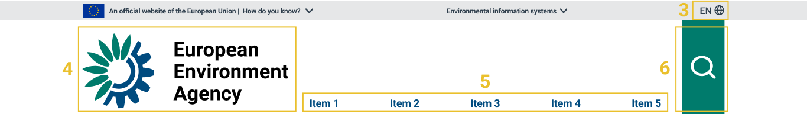

The EEA header shows users that they are on EEA portal and which service they are using.

### Anatomy

| Νο. | Components                                                   | Mandatory | Description |
| -- | ------------------------------------------------------------ | --------- | --------- |
| 1 | **Official EU website statement**                                                | yes       | All official European Union website addresses are in the europa.eu domain |
| 2 | **Environmental Information systems**              | yes       | Complete list of EEA's thematic websites |
| 3 | **Languages**      | no       | Language select |
| 4 | **EEA Identity**                                         | yes       | Logo of European Environmental Agency |
| 5 | **Menu**                                         | yes       |  Main navigation of the website
| 6 | **Search**                                         | yes       | 	Enables the user to search and retrieve related information from using keywords |

### Do’s
- You must use the EEA header at the top of every page if your service is being hosted on one of these domains:
    - Eea.europa.eu
- Make sure that contain all mandatory element from the Anatomy table

### Dont’s
- (\*) You must not use the EEA's logo and menu if your service is not being hosted in one of the above domains.
